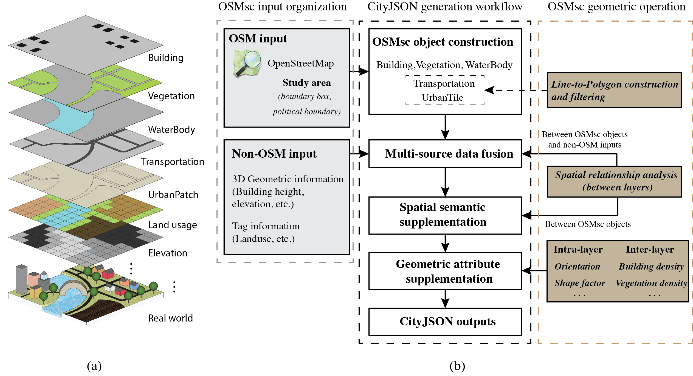

OSMsc 
=====
*updated 30 Nov 2021*

 This repo created an easy-to-use Python package, named OSMsc, to improve the availability, consistency and generalizability of urban semantic data.

 
Photo by <a href="https://unsplash.com/@akeenster?utm_source=unsplash&utm_medium=referral&utm_content=creditCopyText">Abigail  Keenan</a> on <a href="https://unsplash.com/?utm_source=unsplash&utm_medium=referral&utm_content=creditCopyText">Unsplash</a>

The main contributions of OSMsc are reflected in the following aspects:
* Construct semantic city objects based on the public dataset (OpenStreetMap), apply geometric operations to build the incomplete objects, and store them in their respective data layers.
* Fuse 3D and tag information from multiple data sources through the spatial analysis between OSMsc layers and other non-OSM data layers.
* Supplement the spatial semantics and geometric properties to city objects through object layer analysis.
* Utilize each data layer as a unit to output the final CityJSON semantic objects

 OSMsc workflow

### Installation

Install from [PyPi](https://pypi.org/project/osmsc/)

`pip install osmsc`

Install from [Github](https://github.com/ruirzma/osmsc)

`git clone https://github.com/ruirzma/osmsc.git`

`cd osmsc/`

`pip install .` or `python setup.py install`

### Examples
[OSMsc demonstration notebooks](https://github.com/ruirzma/osmsc/tree/main/examples)

### Reference
    1. Geoff Boeing, OSMnx, https://github.com/gboeing/osmnx
    2. Nick Bristow, OSMuf, https://github.com/AtelierLibre/osmuf
    3. Joris Van den Bossche, GeoPandas, https://github.com/geopandas/geopandas

