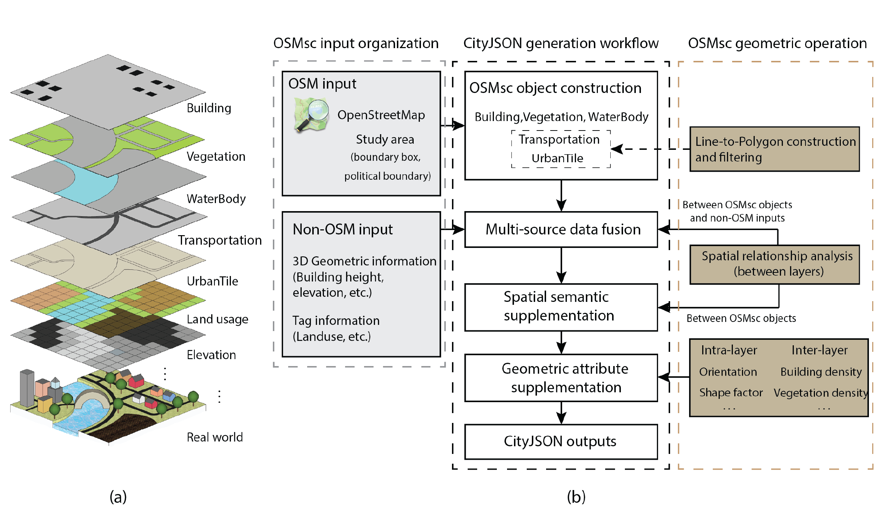

OSMsc 
====

*Updated September 23, 2023*

 This repo develops an easy-to-use Python package, named OSMsc, to improve the availability, consistency and generalizability of urban semantic data.

 **OSMsc v0.2.0 is coming!** 

 
Photo by <a href="https://unsplash.com/@akeenster?utm_source=unsplash&utm_medium=referral&utm_content=creditCopyText">Abigail  Keenan</a> on <a href="https://unsplash.com/?utm_source=unsplash&utm_medium=referral&utm_content=creditCopyText">Unsplash</a>

The main contributions of OSMsc:
* Construct semantic city objects based on the public dataset (OpenStreetMap), and apply geometric operations to build more complete city objects;
* Fuse 3D and tag information from multiple data sources through the spatial analysis between OSMsc layers and other non-OSM data layers;
* Propose the semantic connector(UrbanTile), and supplement the spatial semantics;
* Output the CityJSON-formatted semantic city models.

 OSMsc workflow

 

 Semantic city model generated by OSMsc

### Installation

Install from [Github](https://github.com/ruirzma/osmsc)

`git clone https://github.com/ruirzma/osmsc.git`

`cd osmsc/`

`pip install .` or `python setup.py install`

Install from [PyPi](https://pypi.org/project/osmsc/)

`pip install osmsc`

Note: 

* OSMnx should be installed before OSMsc, installation errors of OSMnx could be resolved in the latest OSMnx [documentation](https://osmnx.readthedocs.io/en/stable/index.html).

* If installing OSMnx manually, you can download the Python extension packages (Rtree, GDAL, Fiona, rasterio, etc.) from [here](https://www.lfd.uci.edu/~gohlke/pythonlibs/) for Windows and [Homebrew🍺](https://brew.sh/) for MacOS.

### Examples

[OSMsc demonstration notebooks](https://github.com/ruirzma/osmsc/tree/main/examples)

### Reference
    1. Geoff Boeing, OSMnx, https://github.com/gboeing/osmnx
    2. Nick Bristow, OSMuf, https://github.com/AtelierLibre/osmuf
    3. Joris Van den Bossche, GeoPandas, https://github.com/geopandas/geopandas

